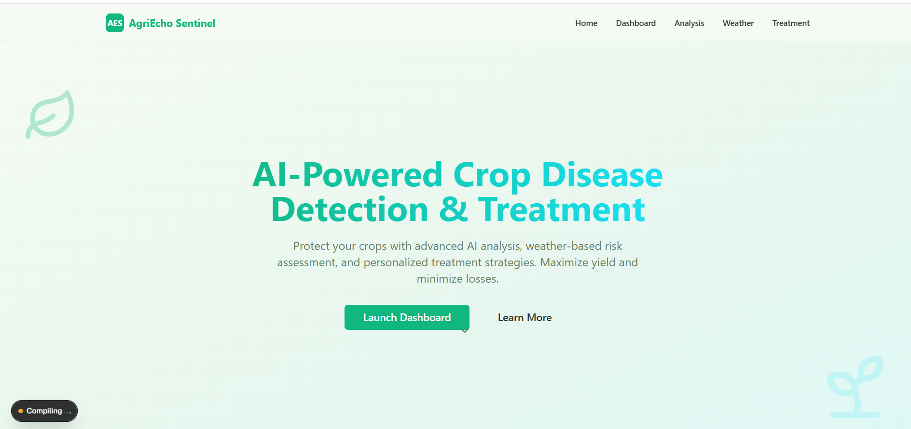

```markdown
# AI Crop Disease Detection & Treatment Platform

# AI Crop Disease Detection & Treatment Platform

A comprehensive AI-powered platform for crop disease detection, weather-based risk assessment, and treatment strategy generation. Built with FastAPI backend and Next.js frontend, leveraging Google's Gemini AI models.

## 🌟 Features

- **Image Analysis**: Upload crop images to detect diseases and get treatment recommendations
- **Weather-based Risk Assessment**: Get disease outbreak predictions based on real-time weather data
- **Treatment Strategy**: Generate AI-powered treatment plans based on crop conditions
- **PDF Export**: Download treatment strategies as PDF reports
- **Responsive Design**: Modern, mobile-friendly interface

## 🏗️ Project Structure

```
gemini-hackathon-project/
├── backend/           # FastAPI backend server
│   ├── services/      # AI model services (image, weather, treatment)
│   ├── tools/         # Utility functions (weather API)
│   ├── schema/        # Pydantic schemas
│   └── main.py        # FastAPI application
└── frontend/          # Next.js frontend application
    ├── app/           # Next.js app router pages
    ├── components/    # React components
    └── lib/           # Utilities and API client
```

## 📋 Prerequisites

- **Python 3.12+** (for backend)
- **Node.js 18+** (for frontend)
- **pnpm** (package manager for frontend)
- **API Keys**:
  - Google Gemini API key
  - OpenWeatherMap API key

## 🚀 Getting Started

### Backend Setup

1. **Navigate to backend directory**:
   ```bash
   cd backend
   ```

2. **Create and activate virtual environment** (recommended):
   ```bash
   # Windows
   python -m venv venv
   venv\Scripts\activate

   # Linux/Mac
   python3 -m venv venv
   source venv/bin/activate
   ```

3. **Install dependencies**:
   ```bash
   pip install fastapi uvicorn python-dotenv google-genai requests
   ```

4. **Configure environment variables**:
   - Copy `.env.example` to `.env`:
     ```bash
     copy .env.example .env    # Windows
     cp .env.example .env      # Linux/Mac
     ```
   - Edit `.env` and add your API keys:
     ```
     GEMINI_API_KEY="your_gemini_api_key_here"
     OPENWEATHER_MAP_API_KEY="your_openweather_api_key_here"
     ```

5. **Run the backend server**:
   ```bash
   uvicorn main:app --reload
   ```
   
   The backend will be available at `http://localhost:8000`
   - API documentation: `http://localhost:8000/docs`

### Frontend Setup

1. **Navigate to frontend directory** (open a new terminal):
   ```bash
   cd frontend
   ```

2. **Install dependencies**:
   ```bash
   pnpm install
   ```
   
   If you don't have pnpm installed:
   ```bash
   npm install -g pnpm
   ```

3. **Run the development server**:
   ```bash
   pnpm dev
   ```
   
   The frontend will be available at `http://localhost:3000`

## 🔑 Getting API Keys

### Google Gemini API Key
1. Go to [Google AI Studio](https://makersuite.google.com/app/apikey)
2. Sign in with your Google account
3. Click "Create API Key"
4. Copy the generated key

### OpenWeatherMap API Key
1. Go to [OpenWeatherMap](https://openweathermap.org/api)
2. Sign up for a free account
3. Navigate to "API keys" section
4. Copy your default API key or create a new one

## 📡 API Endpoints

### 1. Image Analysis
- **Endpoint**: `POST /image_analysis`
- **Description**: Analyzes crop images to detect diseases
- **Request**: Multipart form data with image file
- **Response**: JSON with crop type, disease, severity, and treatments

### 2. Disease Risk Assessment
- **Endpoint**: `GET /disease-risk/{city}`
- **Description**: Predicts disease outbreak risk based on weather
- **Request**: City name as path parameter
- **Response**: JSON with weather data and risk assessment

### 3. Treatment Strategy
- **Endpoint**: `POST /treatmentstrategy`
- **Description**: Generates treatment plans based on situation description
- **Request**: JSON with `input_text` field
- **Response**: JSON with detailed treatment strategy

## 🛠️ Development

### Backend Development
- The backend uses FastAPI with automatic reload enabled
- API documentation is auto-generated at `/docs`
- Models are in the `services/` directory
- Add new endpoints in `main.py`

### Frontend Development
- Built with Next.js 16 and React 19
- Uses Tailwind CSS for styling
- Components are in `components/` directory
- API calls are centralized in `lib/api.ts`

## 📦 Tech Stack

### Backend
- **FastAPI**: Modern Python web framework
- **Google Gemini**: AI models for analysis
- **OpenWeatherMap API**: Weather data
- **Uvicorn**: ASGI server

### Frontend
- **Next.js 16**: React framework
- **React 19**: UI library
- **Tailwind CSS**: Styling
- **Axios**: HTTP client
- **Zustand**: State management
- **Radix UI**: Component library

## 🐛 Troubleshooting

### Backend Issues

**Module not found errors**:
- Ensure all `__init__.py` files exist in `services/`, `schema/`, and `tools/` directories
- Check that virtual environment is activated

**API key errors**:
- Verify `.env` file exists in backend directory
- Check that API keys are valid and properly formatted

### Frontend Issues

**Port already in use**:
```bash
# Kill process on port 3000 (Windows)
netstat -ano | findstr :3000
taskkill /PID <PID> /F

# Kill process on port 3000 (Linux/Mac)
lsof -ti:3000 | xargs kill -9
```

**Dependencies installation fails**:
- Try clearing cache: `pnpm store prune`
- Delete `node_modules` and `pnpm-lock.yaml`, then reinstall

## 📄 License

This project is created for the Gemini Hackathon.

## 🤝 Contributing

Contributions are welcome! Please feel free to submit issues or pull requests.

## 📧 Support

For questions or issues, please open an issue on the repository.
